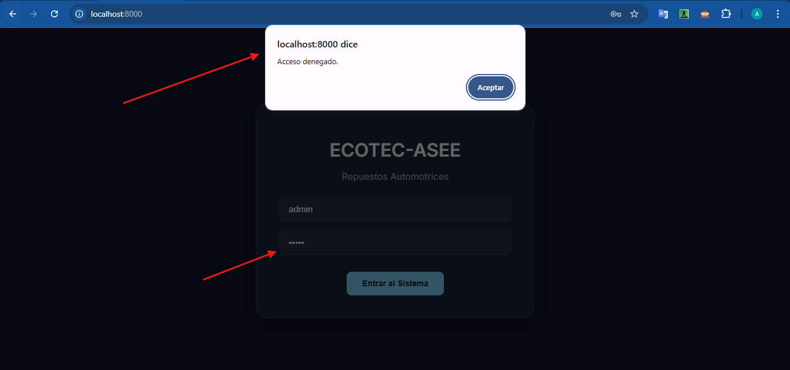
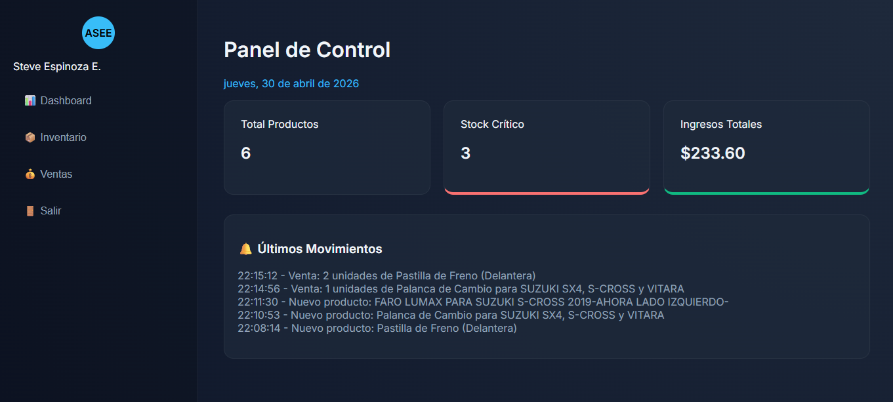
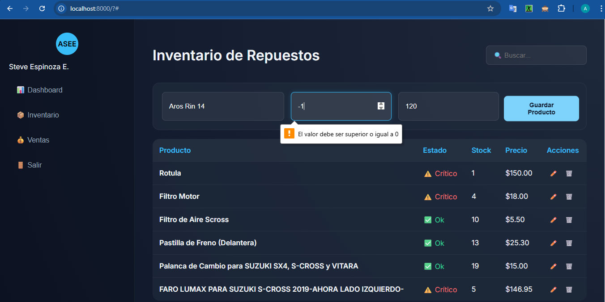
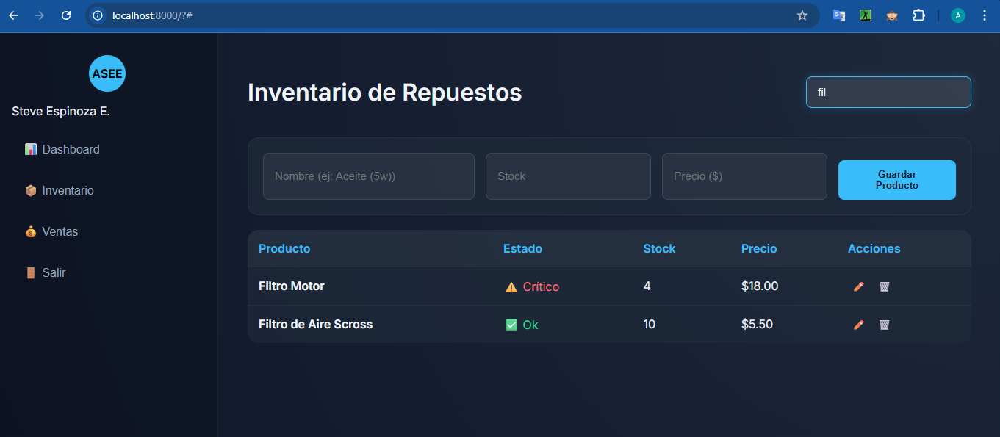
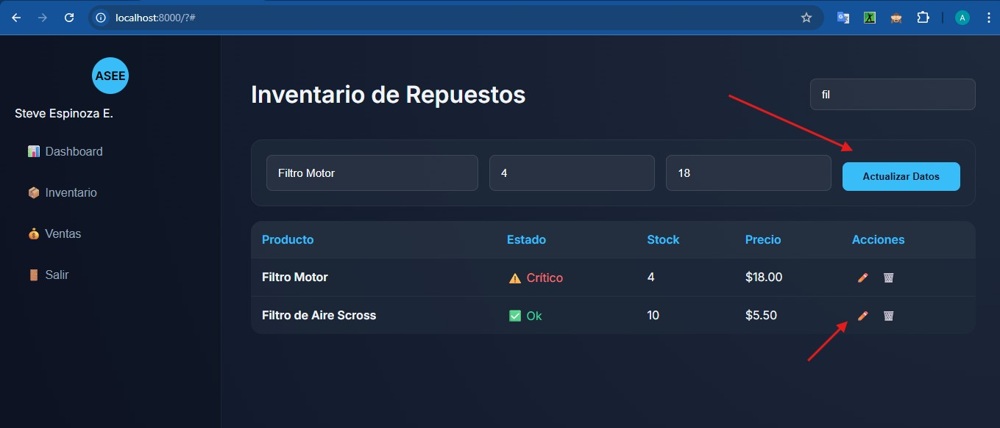
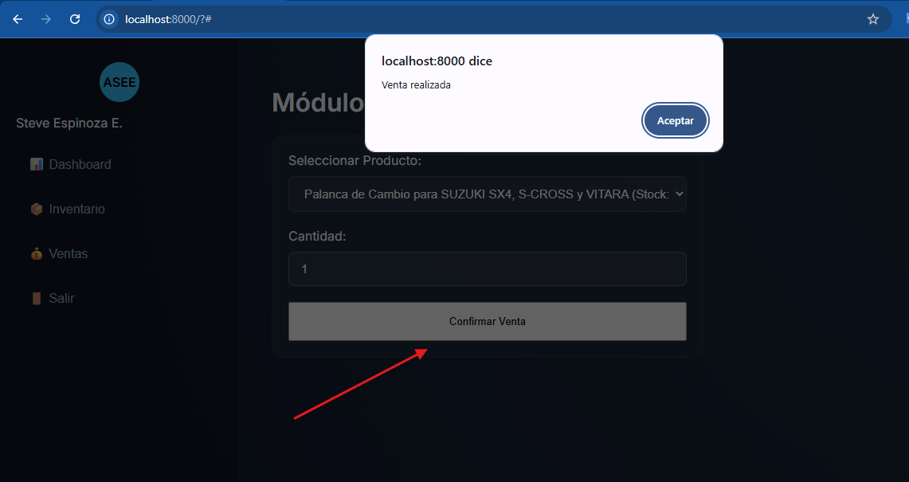
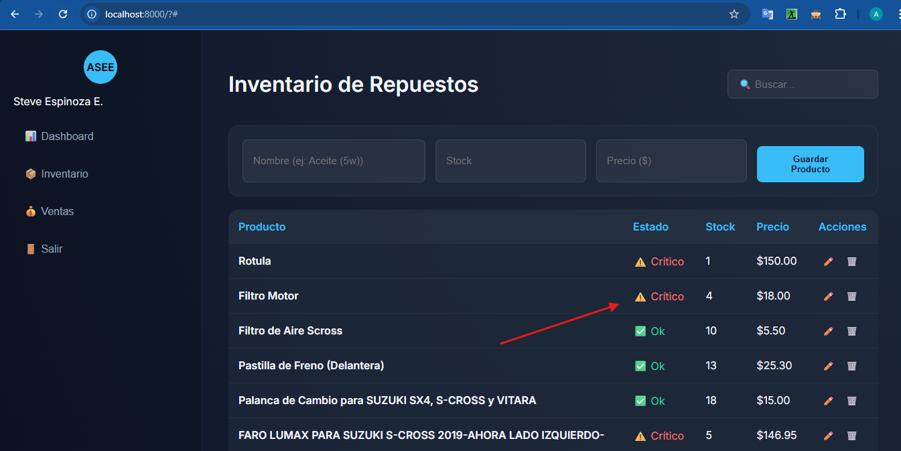
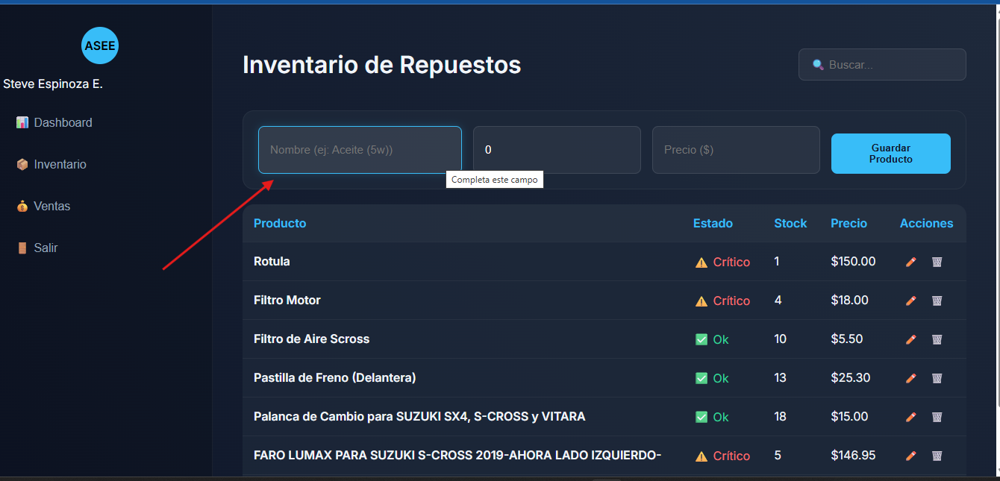

# ECOTEC-ASEE | Sistema de Gestión de Repuestos Automotrices

**ECOTEC-ASEE** Solución web diseñada para el control de inventario y gestión de salidas (ventas) de repuestos técnicos. 

---

## 🛠️ Características del Sistema

- **Interfaz de Usuario :** Diseño con efectos de transparencia y desenfoque.
- **Seguridad:** Módulo de acceso (Login) para protección de datos.
- **Gestión Integral (CRUD):** Creación, lectura, actualización y eliminación de repuestos en tiempo real.
- **Validaciones Robustas:** Control de stock (no negativo), nombres obligatorios y precios mayores a cero.
- **Módulo de Salidas:** Registro de ventas con actualización automática de existencias.
- **Dashboard Inteligente:** Indicadores de total de productos, alertas de stock crítico y balance de caja.
- **Historial de Log:** Registro dinámico de los últimos movimientos realizados en el sistema.

---

## 🚀 Requisitos para la Implementación

Para ejecutar este proyecto de forma local o en un servidor, se requiere:

1.  **Servidor Web Local:** XAMPP, WAMP o Laragon (con PHP 7.4 o superior).
2.  **Navegador Moderno:** Google Chrome, Microsoft Edge o Firefox (con soporte para LocalStorage).
3.  **Editor de Código:** Visual Studio Code o similar.

**Pasos de instalación:**
1. Clonar o descargar el repositorio en la carpeta `htdocs` de tu servidor local.
2. Abrir el navegador y dirigirse a `http://localhost/ASEE_AI2/index.php`.

---

## 🔐 Credenciales de Acceso

El sistema cuenta con un acceso restringido por defecto (hardcoded) para fines académicos:

| Usuario | Contraseña |
| :--- | :--- |
| **admin** | **asee2026** |

---

## 📸 Funcionalidades y Capturas

A continuación, se detallan las secciones del sistema. 

### 1. Pantalla de Acceso (Login)
Interfaz de entrada con validación de credenciales.

### 2. Panel Principal (Dashboard)
Resumen ejecutivo con estadísticas rápidas, fecha dinámica e historial de movimientos.

### 3. Gestión de Inventario (CRUD)
Formulario con validaciones para el registro de repuestos y tabla de visualización con badges de estado.

### 4. Buscador en Tiempo Real
Filtro dinámico que permite encontrar repuestos rápidamente por nombre sin recargar la página.

### 5. Edición de Repuestos
Función que permite recuperar los datos de un producto en el formulario para su actualización.

### 6. Módulo de Ventas
Interfaz para procesar salidas de inventario, afectando el stock y los ingresos totales del sistema.

### 7. Alertas de Stock Crítico
Indicador visual automático (Badge Rojo) cuando un producto tiene 5 unidades o menos.

### 8. Diseño Responsivo y Glassmorphism
Detalle visual de los campos de texto estilizados y efectos de enfoque (focus).

---

## 👨‍💻 Autor
**Steve (Alberto S. Espinoza E.)**  
Actividad Integradora 2 - Programación Web.